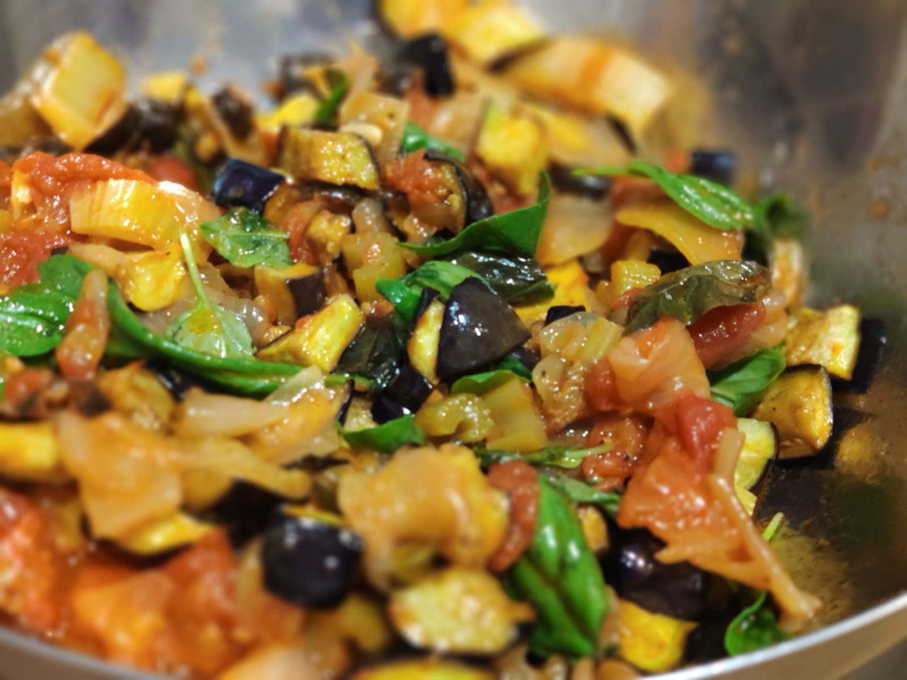

Receta italiana típica para el aperitivo. Es una especie de escabeche de pisto que se sirve frío.

## Ingredientes
- 1 kg de berenjenas
- 1 cebolla dulce grande
- 2 ramas de apio
- 3 cucharadas de concentrado de tomate
- 350 g de tomates pelados (pueden ser en conserva)
- 150 g de aceitunas
- 125 ml de vinagre de vino blanco
- 3 cucharadas de alcaparras
- 3 cucharadas rasas de azúcar
- Aceite de oliva

## Preparación

1. Cortar las berenjenas en láminas muy gruesas (unos dos dedos), salarlas, colocarlas en un colador y prensarlas para quitarlas el amargor. salarlas y freírlas en tandas en la cazuela con mucho aceite.

2. Cortar la cebolla y el apio en grueso y sofreír. 

3. Cuando esté la cebolla blanda, añadir el tomate, las alcaparras y las aceitunas, sofreír unos 10 minutos.

4. Preparar salsa agridulce, con el vinagre, el tomate concentrado y el azúcar. Añadir al sofrito y esperar otros 15 min hasta que espese. Apagar y esperar a que enfríe.

5. Mientras se hace el sofrito, cortar la berenjena en dados gruesos. Freír en tandas, cubiertas por aceite muy caliente. Secar en papel absorbente. 

6. Cuando la salsa y las berenjenas estén frías, mezclarlas y corregir de sal, pimienta y azúcar. Guardar en la nevera durante unas horas. Servir la caponata fría en una tosta de pan.

## Referencias
- [GialloZafferano](https://www.youtube.com/watch?v=CJG1rRFL95s)
- [El comidista](https://elcomidista.elpais.com/elcomidista/2020/06/01/receta/1591034173_440791.html)