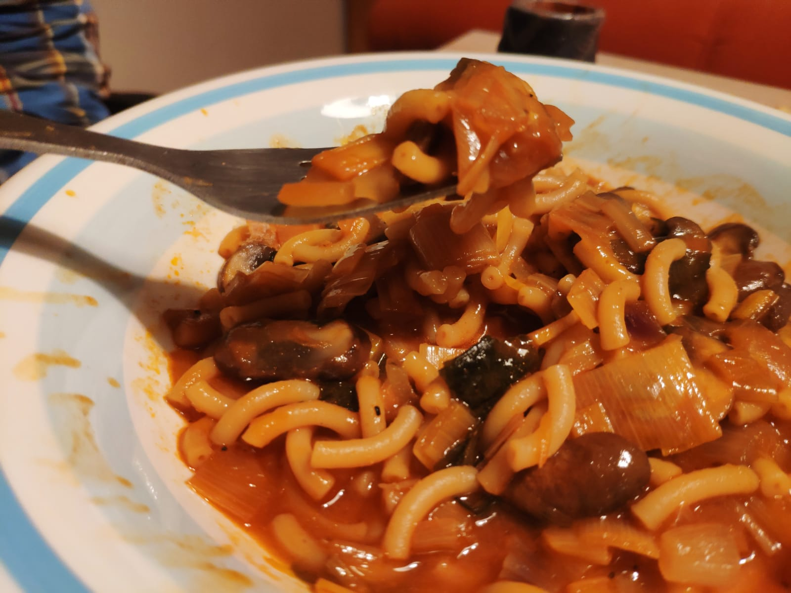

Este plato es una mezcla de la fideuá valenciana y el rámen. Mezcla sabores típicos de levante, como el sofrito de tomate y ajos, con la sopa de miso, las algas y la salsa de soja. Para 4 personas.

## Ingredientes
- 2 puerros
- 1 cebolla dulce pequeña
- 2 dientes de ajo
- 250 g de setas
- 300 g de fideos
- 3 cucharadas de concentrado de tomate
- 2 cucharaditas de pimentón picante
- Algas
- Miso
- Salsa de soja
- Aceite de oliva
- Mantequilla

## Preparación
1. Picar y sofreír la cebolla, el ajo y el puerro con aceite y un poco de mantequilla.

2. Cuando estén blandos, añadir las setas laminadas.

3. En unos 10 minutos, cuando las setas hayan perdido agua, subir el fuego y echar un chorro de vino tinto.

4. Preparar el caldo de miso y mantenerlo hirviendo en un cazo.

5. Cuando se haya evaporado el vino, añadir los fideos y el pimentón y el tomate concentrado. Dorar durante un minuto.

6. Añadir las algas y tres cucharadas de salsa de soja. Verter un poco de caldo. Ir añadiendo caldo poco a poco, de forma que no quede nunca seco.

7. Cuando estén los fideos hechos, sacar del fuego y corregir de sal, pimienta y salsa de soja. Cubrir con un paño y dejar reposar 5 min.

## Ideas
- Añadir confit de pato o tofu.

- Usar setas shiitake en lugar de champiñones.

- Acompañar con alioli de soja.

- (Arriesgado) Probar a añadir más especias mediterráneas, como azafrán o romero.